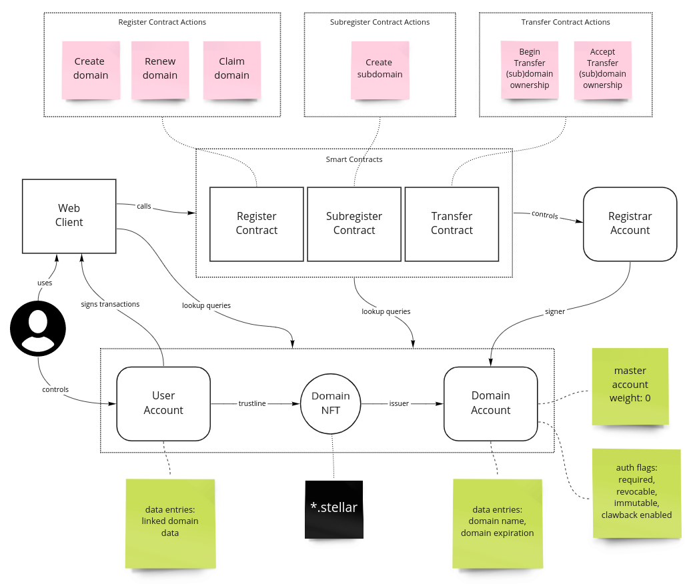

# Stellar Name Service

Stellar NFT Hackathon @SXSW 2022 NFT Wizard Challenge submission.

Demo site: https://ambitious-bush-093e8550f.1.azurestaticapps.net/

Demo registrar: `GBOIBNGQGT3LYOLPJN4BRLVSEAOUDE4D5VTSD3EHRPSC4HEAT2I4BCQY`

## Overview

Stellar Name Service, in spirit similar as Ethereum Name Service, Solana Name Service and so forth.

Essentially **.stellar** domains stored on chain as unique Domain NFTs. Even one level of subdomains are supported (_example.my.stellar_).

_Hint: you can even register unicode IDNA domains like super⭐.stellar_

The Domain NFTs are controlled assets managed by smart contracts and giving their owner the power to link arbitrary data to the domain by assigning managed data entries in the the holding account.



Some known caveats:

- Domain data stored one by one in managed data entries is very limiting. Also account holding multiple Domain NFT:s currently result in same resolved data for them all.
- Domain name length is limited given that it is stored directly in one managed data entry.
- The throughput for `register` and `subregister` smart contracts can be terrible. Transaction sequence is paid by the registrar account to avoid duplicate registrations and that can choke up quite fast.
- A lot of lookups to chain data going on in the contracts which is not always ideal.
- The overall code quality is 🙈😂

## Running locally

The backend `/api` hosting the demo client logic and the smart contracts are implemented with Azure Functions and Typescript.

The client `/app` is implemented with create-react-app and Typescript.

Prerequicites:

- Node.js >= 16 with `yarn`
- [Azure Functions Core Tools](https://docs.microsoft.com/en-us/azure/azure-functions/functions-run-local?tabs=v4)

Start the backend (available in http://localhost:7071/api)

```shell
$ cd api/

# fill in the desired registrar account id and secret key
$ cp local.settings.example.json local.settings.json

$ npm install
$ npm start
```

Start the client (available in http://localhost:3000)

```shell
$ cd app/
$ yarn install
$ yarn start
```
